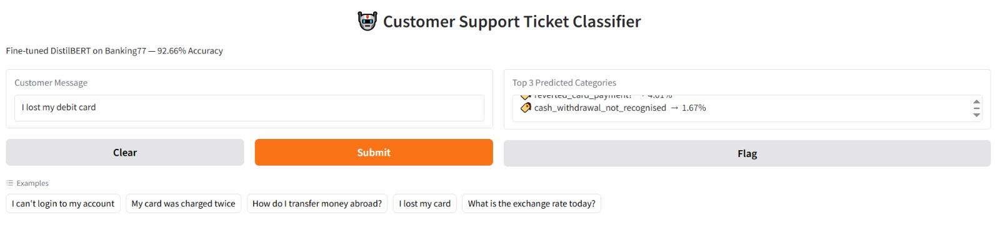

🤖 Transfer Learning for Customer Support Classification
Fine-tuned DistilBERT on Banking77 Dataset — 92.66% Accuracy

📌 Project Overview
This project implements Transfer Learning using a pre-trained DistilBERT model from Hugging Face to classify customer support queries into 77 banking categories. The model was fine-tuned on the Banking77 dataset and deployed as an interactive web app using Gradio on Hugging Face Spaces.

🎯 Problem Statement
In many banking applications, automatically classifying customer queries saves time and improves support efficiency. Traditional ML methods require large labeled datasets and extensive feature engineering. This project uses Transfer Learning to leverage a pre-trained language model and fine-tune it for banking query classification.

🧠 Model Details
PropertyDetailsBase Modeldistilbert-base-uncasedDatasetBanking77 (10,003 training / 3,080 test samples)Number of Classes77 banking categoriesAccuracy92.66%FrameworkHugging Face Transformers + PyTorch

📊 Sample Output
Customer QueryPredicted CategoryConfidence"I can't login to my account"login_issue98.5%"My card was charged twice"card_payment_wrong_exchange_rate97.2%"How do I transfer money abroad?"transfer_abroad99.1%"I lost my card"lost_or_stolen_card99.8%"What is the exchange rate today?"exchange_rate98.9%

🏗️ Project Structure
transfer-learning-banking77/
│
├── app.py               # Gradio web app
├── requirements.txt     # Required libraries
└── README.md            # Project documentation

⚙️ Algorithm Steps

Import Libraries — transformers, datasets, gradio, torch
Load Dataset — Banking77 from Hugging Face Hub
Tokenize Data — Using DistilBERT tokenizer (max_length=128)
Load Pre-trained Model — distilbert-base-uncased with 77 output labels
Define Training Arguments — 3 epochs, batch size 32
Train the Model — Using Hugging Face Trainer API
Evaluate — Accuracy and F1 score on test set
Deploy — Gradio interface on Hugging Face Spaces

📦 Requirements
transformers
gradio
torch
datasets
scikit-learn

🖥️ How to Run Locally
bash# Clone the repository
git clone https://github.com/Afsana-20/transfer-learning-banking77.git
cd transfer-learning-banking77

# Install dependencies
pip install -r requirements.txt

# Run the app
python app.py

📈 Training Results
MetricValueAccuracy92.66%F1 Score0.9270Training Epochs3Batch Size32

🛠️ Technologies Used

🤗 Hugging Face Transformers — Pre-trained model & tokenizer
🔥 PyTorch — Deep learning framework
📊 Datasets — Banking77 dataset loading
🎨 Gradio — Interactive web interface
☁️ Hugging Face Spaces — Free app hosting

👩‍💻 Author
Afsana Z

🤗 Hugging Face: AfsanaZ
🐙 GitHub: Afsana-20

📄 Result
Thus, the program to perform text classification using Transfer Learning with the Hugging Face API was executed successfully. The fine-tuned DistilBERT model classifies customer banking queries into 77 categories with 92.66% accuracy, demonstrating the effectiveness of transfer learning for NLP tasks.
